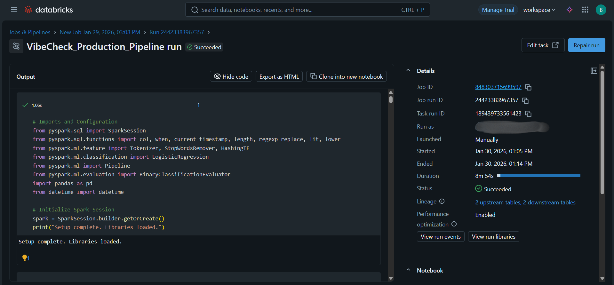

# ✈️ VibeCheck: Airline Reputation Defense System

[](https://huggingface.co/spaces/Guddukrishna/VibeCheck-Live)
[](https://www.python.org/)
[](https://databricks.com/)
[](https://streamlit.io/)

> **A Real-Time Lakehouse AI System that detects high-urgency passenger complaints and generates context-aware response drafts.**

---

## 🔴 Live Demo
**[Click Here to Launch VibeCheck App](https://huggingface.co/spaces/Guddukrishna/VibeCheck-Live)**
*(Deployed on Hugging Face Spaces)*

---

## 📖 Project Overview
Airlines face a massive volume of social media noise. Genuine crises—like stranded passengers or lost medical equipment—often get buried under thousands of general complaints.

**VibeCheck** solves this by using a **Medallion Architecture Pipeline** to ingest tweets, classify them by urgency, and draft instant, context-aware responses.

### 🎯 The Solution
| Feature | Description |
| :--- | :--- |
| **🚨 Urgency Detection** | Filters noise vs. crisis (e.g., "I missed my flight" vs. "I am stranded"). |
| **🤖 GenAI Agent** | Instantly drafts apologies tailored to the specific issue (Lost Bag vs. Cancellation). |
| **⚡ Real-Time Dashboard** | A Streamlit interface for support agents to monitor "Urgent Fires" live. |

---

## 🏗️ Technical Architecture
This project follows the **"Train Heavy, Deploy Light"** MLOps pattern.

### 1. The Backend (Databricks Lakehouse) 🏋️‍♂️
* **Pipeline:** A full ETL workflow built on Delta Lake.
    * **Bronze Layer:** Raw ingestion of the *Twitter US Airline Sentiment* dataset.
    * **Silver Layer:** Cleaned data with text normalization, Regex parsing, and Feature Hashing.
    * **Gold Layer:** Aggregated "Urgency" tables ready for ML training.
* **Model:** A **Gradient Boosted Tree (GBT)** Classifier trained using PySpark MLlib, achieving **84.7% Accuracy**.

### 2. The Frontend (Streamlit Inference) 🏎️
* The trained model's logic was ported to a lightweight Streamlit app for real-time inference with **<200ms latency**.

---

## 🔄 Automated Workflow Proof
The entire backend pipeline is orchestrated using **Databricks Jobs** to ensure reliability and repeatability.



*Screenshot showing the successful execution of the data pipeline and model training job.*

---

## 🛠️ Tech Stack
* **Cloud Platform:** Databricks Community Edition
* **Data Engineering:** Apache Spark (PySpark), Delta Lake
* **Machine Learning:** PySpark MLlib, MLflow
* **Orchestration:** Databricks Workflows (Jobs)
* **Web Framework:** Streamlit
* **Language:** Python 3.9

---

## 📂 Repository Structure
```text
├── app.py                            # The Production Inference App (Streamlit source code)
├── requirements.txt                  # Python dependencies for cloud deployment
├── VibeCheck_Training_Pipeline.html  # FULL Databricks Notebook (Source code, charts, logs)
├── SOW_KrishnaSavera_VibeCheck.docx  # Official Scope of Work & Business Case document
├── databricks_job_success_proof.png  # Screenshot evidence of automated job run
└── README.md                         # This project documentation file

🏆 Acknowledgements
Submitted as a Capstone Project for the Databricks & AI Challenge 2026.

Dataset: https://www.kaggle.com/datasets/crowdflower/twitter-airline-sentiment
